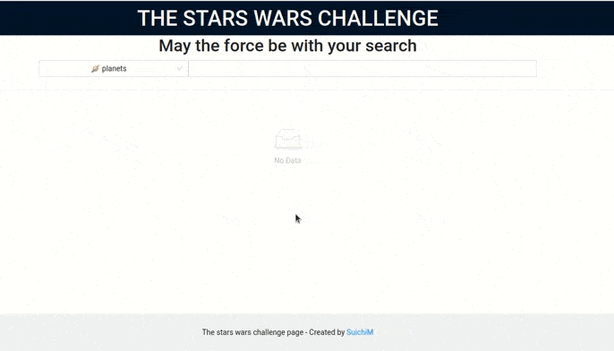

# The Stars Wars Challengue

This is a React & Typescrypt based project, that allow you interact with the [SW-API](https://swapi.dev/)



stack:

- Coded on React 17
- Uses hooks instead of Classes.
- Uses Context API. (Avoiding Redux)
- Fully typed using typescript.
- Follows [Airbnb code style](https://github.com/airbnb/javascript)

## setting the project for dev

in all cases you must clone this repository as first step

```sh
## by https
git clone https://github.com/SuichiM/starsWarsProject.git

## or by ssh
git clone git@github.com:SuichiM/starsWarsProject.git
```

you have serveral ways to run the project, we strongly recommend run the project in a [docker](https://www.docker.com/) container using [docker-compose](https://docs.docker.com/compose/install/).

### running on your local machine

requirements node 12+

1. install the dependecies

```sh
npm i
```

2. run the dev server

```sh
npm run start
```

### running on a docker container

1. build the container

```sh
docker build  -t my_stars_wars_container .
```

2. run the container

```
docker run -p 8080:8080 -v $PWD:/home/app -d my_stars_wars_container
```

3. install the dependencies

```sh
docker exec <container_name> npm i
```

3. run the dev server

```sh
docker exec <container_name> npm run start
```

### running with docker-compose

having `docker-compose` simplifies the process to run the project in a container.

1. build and run the service

```sh
docker-compose up -d
```

2. install the dependecies

```sh
docker-compose exec web npm i
```

3. run the dev server

```sh
docker-compose exec web npm run start
```

## OTHER COMMANDS TO RUN

```sh
# compile the project for production
npm run build

# lint and fix the files follow the styleguide
npm run lint

#format the code
npm run format
```

## testing with cypress

by the moment the test can run only with the dev server running

### running the tests on command line

````sh
docker run -it --rm \
 --network host \
  -e CYPRESS_baseUrl=http://localhost:8080 \
  -v $PWD:/e2e \
  -w /e2e \
  --entrypoint cypress \
  cypress/included:6.2.1 run --project .```
````

### opening the cypress UI for run the tests

run this command on a terminal

```sh
xhost +local:
```

```sh
 docker run -it --rm \
 --network host \
  -v ~/.Xauthority:/root/.Xauthority:ro \
  -e DISPLAY=unix${DISPLAY} \
  -e CYPRESS_baseUrl=http://localhost:8080 \
  -v $PWD:/e2e \
  -w /e2e \
  --entrypoint cypress \
  cypress/included:6.2.1 open --project .
```

feel free to send your PR for any improvement or bugfix

SuichiM
